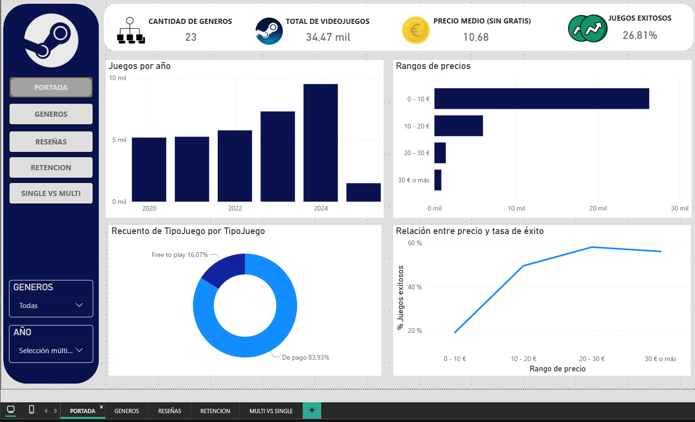
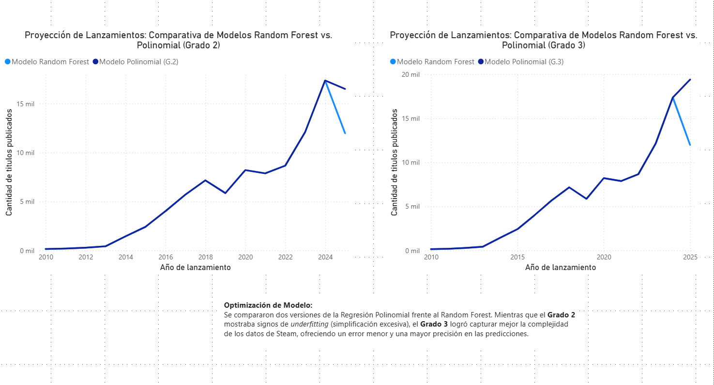

# steam-data-analysis-ml
Análisis de datos de Steam, modelos de ML y dashboards de Power BI.

# 🎮 Steam Insights: ¿Qué define el éxito de un videojuego?

Este proyecto nace de una pregunta clave: **¿Qué hace exitoso a un videojuego en la actualidad?** En un mercado saturado donde la atención es el recurso más escaso, hemos analizado más de **34.000 títulos** para entender que el éxito ya no depende solo de las ventas, sino de la capacidad de retener al usuario.

## 📌 Resumen del Proyecto
A través de un flujo **End-to-End**, transformamos datos brutos de la API de Steam en *insights* de negocio y modelos predictivos capaces de anticipar la inercia del mercado para el año 2025.

---

## 🎯 Objetivos Principales
* **Identificar los patrones de éxito:** Analizar la relación entre Popularidad, Satisfacción y Engagement.
* **Resolver el "sesgo de datos":** Corregir el vacío de información mediante técnicas de Machine Learning.
* **Predecir el futuro:** Estimar el volumen de lanzamientos para el cierre de 2025.

---

## 🛠️ Fases del Proyecto

### 1. Limpieza y Retos de Datos
Trabajamos inicialmente con más de **100.000 registros**, enfrentándonos a datos incompletos y mal estructurados.
* **Criterio de "Era Moderna":** Filtramos los datos desde 2015 para evitar el ruido de la industria antigua y centrarnos en la explosión digital actual.
* **Reducción de variables:** De 37 variables originales, seleccionamos las métricas con mayor poder predictivo para evitar el sobreajuste.

### 2. Enfoque Analítico (Insights Clave)
El éxito se midió mediante un enfoque multifactorial:
* **El Mito del Precio:** Existe una relación directa entre precio y éxito, pero no es determinante. Juegos de bajo coste pueden alcanzar niveles de impacto similares a los Triple A.
* **Popularidad vs. Calidad:** Un alto volumen de reseñas no garantiza valoraciones positivas.
* **El Factor Engagement:** El **tiempo de juego** es el indicador más sólido de éxito real.
* **Free vs Paid:** Aunque los juegos gratuitos atraen más usuarios, los **juegos de pago generan experiencias más profundas** y una retención mayor.

> 
> *Visualización de la relación entre engagement y modelo de negocio.*

### 3. Machine Learning: Superando el "Falso Descenso"
Al analizar los lanzamientos, detectamos una caída en picado en 2025 debido a que el dataset solo cubría los primeros 3 meses del año. 

**El Duelo de Modelos:**
* **Random Forest:** Resultó ser demasiado conservador; al promediar resultados, no lograba capturar la tendencia alcista del mercado actual.
* **Regresión Polinomial (Grado 3):** Fue el modelo ganador. Gracias a su flexibilidad, pudo captar la aceleración del mercado y proyectar una curva realista para los meses restantes de 2025.

> 
> *Comparativa técnica: La Regresión de Grado 3 capturando la inercia del mercado frente al Random Forest.*

### 4. Validación Externa (Kaggle)
Contrastamos nuestro modelo con una fuente externa independiente (**FronkonGames - Steam Dataset**).
* **Resultado:** Aunque los volúmenes totales variaban por el tipo de filtrado, **la forma de la curva fue casi idéntica**. Nuestro modelo validó que 2025 será el año con mayor actividad en la historia de Steam.

---

## 📂 Estructura del Repositorio
* **`/notebooks`**: ETL, limpieza y entrenamiento de los modelos Scikit-Learn.
* **`/dashboards`**: Análisis visual de engagement y comparativa de modelos en Power BI.
* **`/data`**: Documentación de los datasets (Principal y Control/Kaggle).
* **`/screenshots`**: Evidencia visual de los dashboards y resultados.

---

## 🚀 Stack Tecnológico
* **Análisis y ML:** Python (Pandas, Scikit-learn).
* **Visualización:** Power BI Desktop.
* **Metodología:** Análisis de series temporales y validación cruzada externa.

---

## 👤 Equipo y Contacto
* **Tu Nombre** - [LinkedIn](tu-link-aqui)
* **Integrantes del equipo:** Jose, Marta, Victor, Urko.
